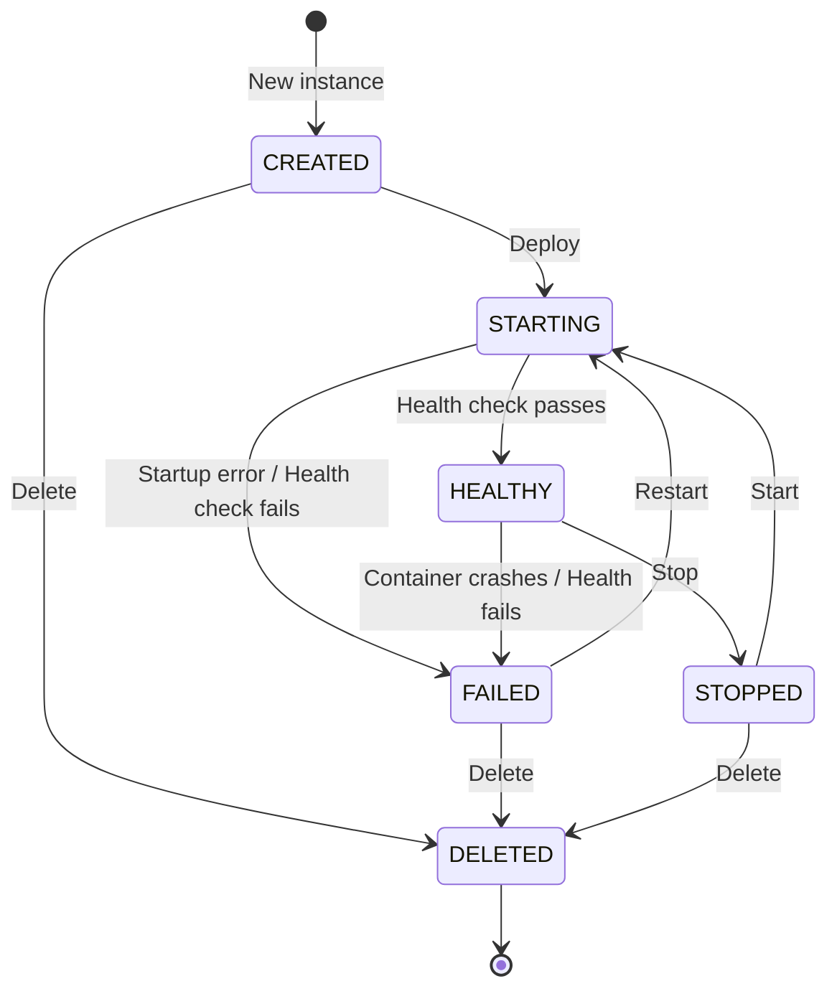
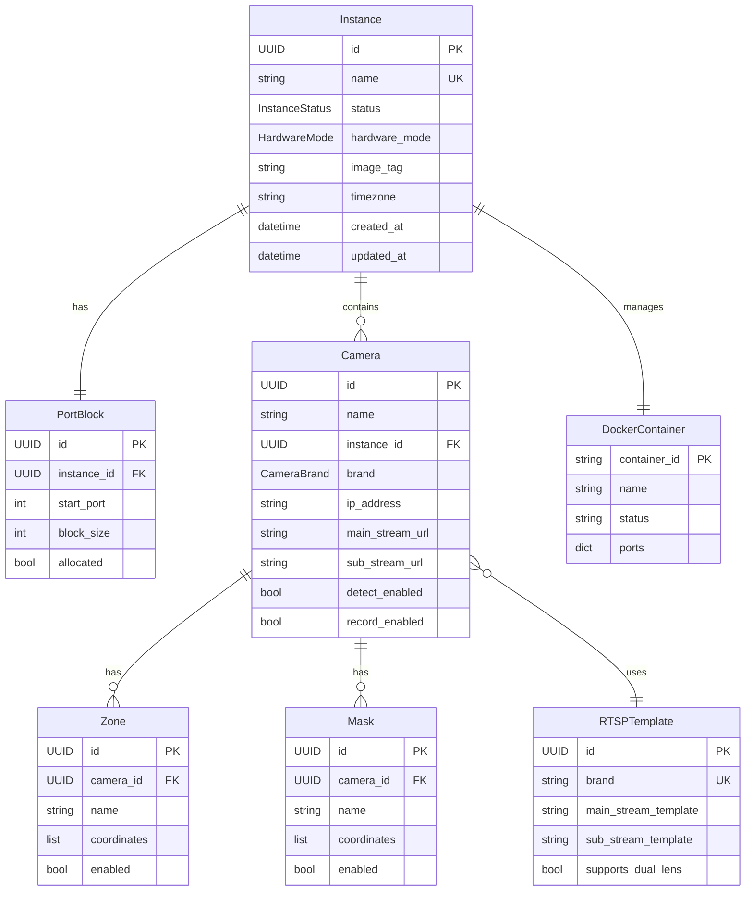
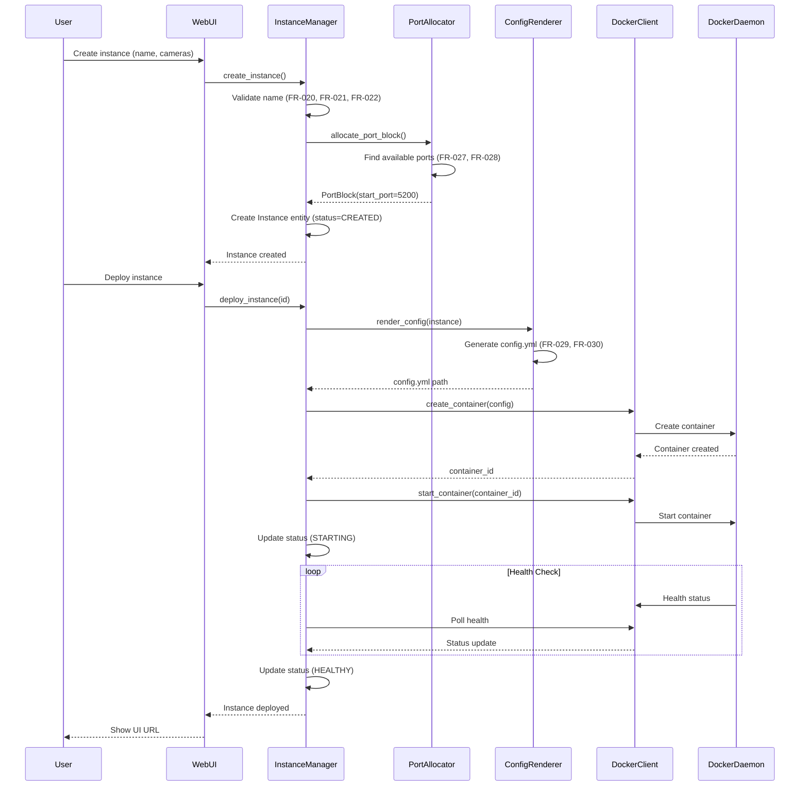
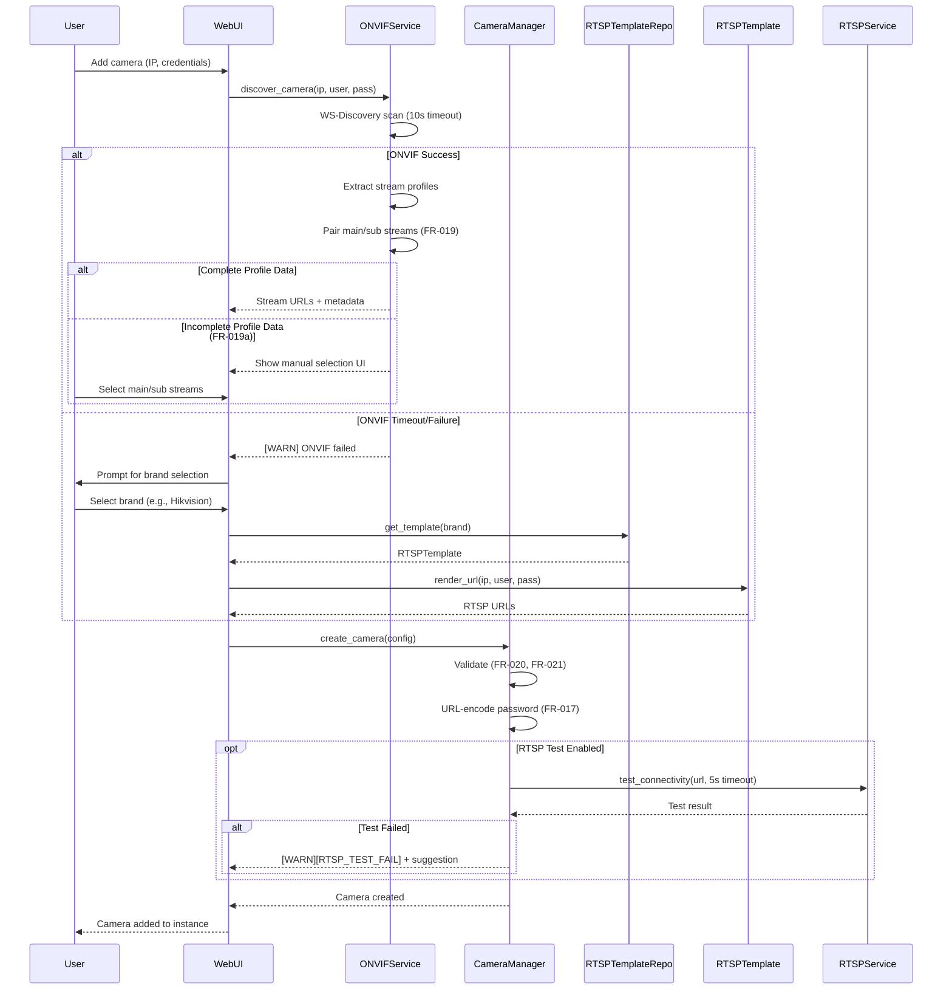

# Data Model: Frigate Configuration UI

**Feature Branch**: `001-frigate-webui-deployment`
**Created**: 2025-10-18
**Status**: Draft
**Version**: 1.0

## Table of Contents

1. [Core Entities](#1-core-entities)
2. [Enumerations](#2-enumerations)
3. [Storage Strategy](#3-storage-strategy)
4. [Pydantic Models](#4-pydantic-models)
5. [Validation Rules](#5-validation-rules)
6. [State Transitions](#6-state-transitions)
7. [Relationship Diagrams](#7-relationship-diagrams)

---

## 1. Core Entities

### 1.1 Instance

Represents a deployed Frigate container instance managed by the parent WebUI container.

**Attributes:**

| Attribute | Type | Required | Description | Default | Constraints |
|-----------|------|----------|-------------|---------|-------------|
| `id` | `UUID` | Yes | Unique instance identifier | Auto-generated | UUID v4 |
| `name` | `str` | Yes | Instance name (human-readable) | None | `^[a-z][a-z0-9-]{2,31}$` |
| `status` | `InstanceStatus` | Yes | Current instance status | `created` | Enum: created/starting/healthy/failed/stopped/deleted |
| `hardware_mode` | `HardwareMode` | Yes | Hardware acceleration mode | `CPU` | Enum: CPU/NVIDIA/Hailo |
| `image_tag` | `str` | Yes | Frigate Docker image tag | `stable` | `^[A-Za-z0-9._-]+$` |
| `timezone` | `str` | Yes | IANA timezone string | `UTC` | Valid IANA timezone |
| `port_block` | `PortBlock` | Yes | Allocated port range | Auto-allocated | See PortBlock entity |
| `cameras` | `List[Camera]` | Yes | List of cameras | `[]` | Min: 0, Max: 50 |
| `config_path` | `Path` | Yes | Path to generated config.yml | Auto-generated | `/data/<instance-name>/config/config.yml` |
| `data_dir` | `Path` | Yes | Data directory path | Auto-generated | `/data/<instance-name>` |
| `container_id` | `str` | No | Docker container ID | None | Set after deployment |
| `container_name` | `str` | Yes | Docker container name | Auto-generated | `frigate-instance-<name>` |
| `created_at` | `datetime` | Yes | Creation timestamp | Auto-generated | ISO 8601 |
| `updated_at` | `datetime` | Yes | Last update timestamp | Auto-generated | ISO 8601 |
| `deployed_at` | `datetime` | No | Deployment timestamp | None | Set when status becomes `starting` |
| `record_retention_days` | `int` | Yes | Recording retention in days | `14` | Min: 1, Max: 365 |
| `snapshot_retention_days` | `int` | Yes | Snapshot retention in days | `10` | Min: 1, Max: 365 |
| `mqtt_enabled` | `bool` | Yes | Enable MQTT integration | `False` | Boolean |
| `mqtt_host` | `str` | No | MQTT broker host | None | Required if mqtt_enabled |
| `mqtt_user` | `str` | No | MQTT username | None | Optional |
| `mqtt_password` | `str` | No | MQTT password (encrypted) | None | Optional |

**Relationships:**
- **Has Many** `Camera` (1:N) - An instance contains multiple cameras
- **Has One** `PortBlock` (1:1) - Each instance has exactly one port block allocation
- **Has One** Docker Container (1:1) - Maps to a single Docker container

**Constraints:**
- Instance name MUST be unique across all instances (FR-021)
- Instance name MUST NOT use reserved names: `frigate-config-deploy`, `frigate` (FR-022)
- Port block MUST NOT conflict with other instances or system services (FR-028)
- At least one camera MUST be configured before deployment
- Hardware mode MUST match available system hardware (auto-downgrade to CPU if unavailable, FR-011)

**Default Values:**
```python
{
    "status": InstanceStatus.CREATED,
    "hardware_mode": HardwareMode.CPU,
    "image_tag": "stable",
    "timezone": "UTC",
    "cameras": [],
    "record_retention_days": 14,
    "snapshot_retention_days": 10,
    "mqtt_enabled": False,
}
```

---

### 1.2 Camera

Represents a camera configuration within a Frigate instance.

**Attributes:**

| Attribute | Type | Required | Description | Default | Constraints |
|-----------|------|----------|-------------|---------|-------------|
| `id` | `UUID` | Yes | Unique camera identifier | Auto-generated | UUID v4 |
| `name` | `str` | Yes | Camera name | None | `^[a-z][a-z0-9-]{2,31}$` |
| `instance_id` | `UUID` | Yes | Parent instance ID | None | Foreign key to Instance |
| `brand` | `CameraBrand` | Yes | Camera brand | None | Enum or Custom |
| `ip_address` | `str` | Yes | Camera IP address | None | Valid IPv4 address |
| `rtsp_port` | `int` | Yes | RTSP port | `554` | 1-65535 |
| `username` | `str` | Yes | Camera username | None | Required |
| `password` | `str` | Yes | Camera password (encrypted) | None | Required |
| `main_stream_url` | `str` | Yes | Main stream RTSP URL | Auto-generated | Valid RTSP URL |
| `sub_stream_url` | `str` | Yes | Sub stream RTSP URL | Auto-generated | Valid RTSP URL |
| `detect_enabled` | `bool` | Yes | Enable object detection | `True` | Boolean |
| `record_enabled` | `bool` | Yes | Enable recording | `True` | Boolean |
| `snapshots_enabled` | `bool` | Yes | Enable snapshots | `True` | Boolean |
| `detect_width` | `int` | Yes | Detection frame width | `1280` | Min: 320, Max: 7680 |
| `detect_height` | `int` | Yes | Detection frame height | `720` | Min: 240, Max: 4320 |
| `detect_fps` | `int` | Yes | Detection frame rate | `5` | Min: 1, Max: 30 |
| `objects` | `List[str]` | Yes | Detected object types | `["person"]` | Valid Frigate object types |
| `zones` | `List[Zone]` | No | Detection zones | `[]` | Optional |
| `masks` | `List[Mask]` | No | Privacy masks | `[]` | Optional |
| `is_dual_lens` | `bool` | Yes | Is dual-lens camera | `False` | Boolean |
| `channel_suffix` | `str` | No | Channel suffix for dual-lens | None | e.g., "-ch1", "-ch2" |
| `onvif_discovered` | `bool` | Yes | Discovered via ONVIF | `False` | Boolean |
| `rtsp_test_passed` | `bool` | No | RTSP connectivity test result | None | Set by connectivity test |
| `created_at` | `datetime` | Yes | Creation timestamp | Auto-generated | ISO 8601 |

**Relationships:**
- **Belongs To** `Instance` (N:1) - Each camera belongs to one instance
- **Has Many** `Zone` (1:N) - Optional detection zones
- **Has Many** `Mask` (1:N) - Optional privacy masks

**Constraints:**
- Camera name MUST be unique within instance (FR-021)
- Camera name MUST match format `^[a-z][a-z0-9-]{2,31}$` (FR-020)
- Dual-lens cameras create 2 camera entities with suffixes (FR-018)
- RTSP URLs MUST have URL-encoded passwords (FR-017)
- IP address MUST be reachable from Frigate container network

**Default Values:**
```python
{
    "rtsp_port": 554,
    "detect_enabled": True,
    "record_enabled": True,
    "snapshots_enabled": True,
    "detect_width": 1280,
    "detect_height": 720,
    "detect_fps": 5,
    "objects": ["person"],
    "zones": [],
    "masks": [],
    "is_dual_lens": False,
    "onvif_discovered": False,
}
```

---

### 1.3 PortBlock

Represents a continuous block of ports allocated to a Frigate instance.

**Attributes:**

| Attribute | Type | Required | Description | Default | Constraints |
|-----------|------|----------|-------------|---------|-------------|
| `id` | `UUID` | Yes | Unique port block identifier | Auto-generated | UUID v4 |
| `instance_id` | `UUID` | Yes | Parent instance ID | None | Foreign key to Instance |
| `start_port` | `int` | Yes | Starting port number | Auto-allocated | 5200-65535 |
| `block_size` | `int` | Yes | Number of ports in block | `10` | Fixed at 10 |
| `allocated` | `bool` | Yes | Allocation status | `True` | Boolean |
| `port_ui` | `int` | Yes | Frigate UI port | `start_port + 0` | Computed |
| `port_rtsp` | `int` | Yes | RTSP restreamer port | `start_port + 1` | Computed |
| `port_webrtc_tcp` | `int` | Yes | WebRTC TCP port | `start_port + 2` | Computed |
| `port_webrtc_udp` | `int` | Yes | WebRTC UDP port | `start_port + 2` | Computed (same as TCP) |
| `port_rtmp` | `int` | Yes | RTMP port (legacy) | `start_port + 3` | Computed |
| `port_go2rtc` | `int` | Yes | go2rtc web interface | `start_port + 4` | Computed |
| `port_auth_ui` | `int` | Yes | Authenticated UI port | `start_port + 5` | Computed |
| `ports_reserved` | `List[int]` | Yes | Reserved ports (6-9) | `start_port + 6..9` | For future use |
| `created_at` | `datetime` | Yes | Allocation timestamp | Auto-generated | ISO 8601 |

**Relationships:**
- **Belongs To** `Instance` (1:1) - Each port block belongs to exactly one instance

**Constraints:**
- Port block MUST NOT overlap with other allocated blocks (FR-027, FR-028)
- Port block MUST NOT conflict with system-used ports
- Start port MUST be divisible by block_size for cleaner allocation
- All ports in block MUST be available before allocation

**Port Mapping:**
```
Block starts at N:
- N+0: Frigate UI (internal, port 5000 inside container)
- N+1: RTSP restreamer (port 8554 inside container)
- N+2: WebRTC TCP/UDP (port 8555 inside container)
- N+3: RTMP streams (port 1935 inside container)
- N+4: go2rtc web interface (port 1984 inside container)
- N+5: Authenticated UI (port 8971 inside container)
- N+6..N+9: Reserved for future use
```

**Default Values:**
```python
{
    "block_size": 10,
    "allocated": True,
}
```

---

### 1.4 RTSPTemplate

Represents pre-configured RTSP URL templates for common camera brands.

**Attributes:**

| Attribute | Type | Required | Description | Default | Constraints |
|-----------|------|----------|-------------|---------|-------------|
| `id` | `UUID` | Yes | Unique template identifier | Auto-generated | UUID v4 |
| `brand` | `str` | Yes | Camera brand name | None | Unique |
| `display_name` | `str` | Yes | User-facing brand name | None | Chinese localized |
| `main_stream_template` | `str` | Yes | Main stream URL template | None | Must contain placeholders |
| `sub_stream_template` | `str` | Yes | Sub stream URL template | None | Must contain placeholders |
| `default_port` | `int` | Yes | Default RTSP port | `554` | 1-65535 |
| `supports_dual_lens` | `bool` | Yes | Supports dual-lens config | `False` | Boolean |
| `dual_lens_channels` | `List[str]` | No | Channel identifiers for dual-lens | None | e.g., ["101", "201"] |
| `protocol_preference` | `str` | Yes | Preferred protocol | `rtsp` | rtsp/http-flv |
| `notes` | `str` | No | Special configuration notes | None | Optional |
| `requires_url_encoding` | `bool` | Yes | Password URL encoding required | `True` | Boolean |

**Template Placeholders:**
- `{user}` - Username (URL-encoded)
- `{password}` - Password (URL-encoded)
- `{ip}` - Camera IP address
- `{port}` - RTSP port
- `{channel}` - Channel number (for dual-lens)

**Example Templates:**
```python
{
    "brand": "hikvision",
    "display_name": "海康威视",
    "main_stream_template": "rtsp://{user}:{password}@{ip}:{port}/Streaming/Channels/101",
    "sub_stream_template": "rtsp://{user}:{password}@{ip}:{port}/Streaming/Channels/102",
    "default_port": 554,
    "supports_dual_lens": True,
    "dual_lens_channels": ["101", "201"],
    "protocol_preference": "rtsp",
    "requires_url_encoding": True,
}
```

**Constraints:**
- Brand name MUST be unique
- Templates MUST contain all required placeholders
- For dual-lens support, `dual_lens_channels` MUST have at least 2 entries

---

### 1.5 Zone

Represents a detection zone within a camera's field of view.

**Attributes:**

| Attribute | Type | Required | Description | Default | Constraints |
|-----------|------|----------|-------------|---------|-------------|
| `id` | `UUID` | Yes | Unique zone identifier | Auto-generated | UUID v4 |
| `camera_id` | `UUID` | Yes | Parent camera ID | None | Foreign key to Camera |
| `name` | `str` | Yes | Zone name | None | Alphanumeric with underscores |
| `coordinates` | `List[Tuple[int, int]]` | Yes | Polygon coordinates | None | Min 3 points, normalized 0-1 |
| `objects` | `List[str]` | No | Object filter for zone | None | Valid Frigate object types |
| `inertia` | `int` | Yes | Motion detection inertia | `3` | 1-10 |
| `enabled` | `bool` | Yes | Zone enabled status | `True` | Boolean |

**Relationships:**
- **Belongs To** `Camera` (N:1) - Each zone belongs to one camera

**Constraints:**
- Coordinates MUST form a valid polygon (min 3 points)
- Coordinates MUST be normalized (0.0-1.0 range)
- Zone name MUST be unique within camera

---

### 1.6 Mask

Represents a privacy mask within a camera's field of view.

**Attributes:**

| Attribute | Type | Required | Description | Default | Constraints |
|-----------|------|----------|-------------|---------|-------------|
| `id` | `UUID` | Yes | Unique mask identifier | Auto-generated | UUID v4 |
| `camera_id` | `UUID` | Yes | Parent camera ID | None | Foreign key to Camera |
| `name` | `str` | Yes | Mask name | None | Alphanumeric with underscores |
| `coordinates` | `List[Tuple[int, int]]` | Yes | Polygon coordinates | None | Min 3 points, normalized 0-1 |
| `enabled` | `bool` | Yes | Mask enabled status | `True` | Boolean |

**Relationships:**
- **Belongs To** `Camera` (N:1) - Each mask belongs to one camera

**Constraints:**
- Coordinates MUST form a valid polygon
- Coordinates MUST be normalized (0.0-1.0 range)

---

## 2. Enumerations

### 2.1 HardwareMode

Hardware acceleration and inference mode for Frigate instances.

```python
class HardwareMode(str, Enum):
    CPU = "cpu"
    NVIDIA = "nvidia"
    HAILO = "hailo"
```

**Mapping to Frigate Configuration:**

| Mode | `hwaccel_args` | `detectors` Config | Device Requirements |
|------|----------------|-------------------|---------------------|
| CPU | `""` (empty) | `{"cpu": {"type": "cpu", "num_threads": 3}}` | None |
| NVIDIA | `"preset-nvidia-h264"` | `{"cpu": {"type": "cpu", "num_threads": 3}}` | NVIDIA runtime, GPU device |
| HAILO | `""` (empty) | `{"hailo8l": {"type": "hailo8l", "device": "PCIe"}}` | `/dev/hailo0` device |

**Notes:**
- CPU mode is the default and always available
- NVIDIA mode requires Docker nvidia runtime (FR-010)
- HAILO mode requires Hailo device plugin (FR-010)
- System auto-downgrades to CPU if hardware unavailable (FR-011)

---

### 2.2 InstanceStatus

Current lifecycle status of a Frigate instance.

```python
class InstanceStatus(str, Enum):
    CREATED = "created"
    STARTING = "starting"
    HEALTHY = "healthy"
    FAILED = "failed"
    STOPPED = "stopped"
    DELETED = "deleted"
```

**Status Descriptions:**

| Status | Description | User-Visible | Container State |
|--------|-------------|--------------|-----------------|
| `created` | Instance configured but not deployed | "已创建" | No container |
| `starting` | Container created and starting up | "启动中" | Running, health starting |
| `healthy` | Container running and health check passing | "运行中" | Running, health healthy |
| `failed` | Container exited or health check failing | "失败" | Exited or unhealthy |
| `stopped` | Container stopped by user | "已停止" | Stopped |
| `deleted` | Instance and container deleted | N/A | No container |

**Valid Transitions:** See Section 6 - State Transitions

---

### 2.3 CameraBrand

Supported camera brands with pre-configured RTSP templates.

```python
class CameraBrand(str, Enum):
    HIKVISION = "hikvision"
    DAHUA = "dahua"
    AMCREST = "amcrest"
    REOLINK = "reolink"
    REOLINK_DUO = "reolink_duo"
    ONVIF_GENERIC = "onvif_generic"
    CUSTOM = "custom"
```

**Chinese Display Names:**
```python
BRAND_DISPLAY_NAMES = {
    CameraBrand.HIKVISION: "海康威视",
    CameraBrand.DAHUA: "大华",
    CameraBrand.AMCREST: "Amcrest",
    CameraBrand.REOLINK: "Reolink",
    CameraBrand.REOLINK_DUO: "Reolink Duo (双镜头)",
    CameraBrand.ONVIF_GENERIC: "ONVIF 通用",
    CameraBrand.CUSTOM: "自定义",
}
```

---

### 2.4 ErrorCode

Standardized error codes for logging and user feedback (FR-038).

```python
class ErrorCode(str, Enum):
    # Docker errors
    DOCKER_SOCKET = "DOCKER_SOCKET"
    DOCKER_DAEMON = "DOCKER_DAEMON"
    DOCKER_SOCKET_PERMISSION = "DOCKER_SOCKET_PERMISSION"

    # Port errors
    PORT_CONFLICT = "PORT_CONFLICT"
    PORT_EXHAUSTED = "PORT_EXHAUSTED"

    # Image errors
    IMAGE_PULL = "IMAGE_PULL"
    IMAGE_NOT_FOUND = "IMAGE_NOT_FOUND"
    IMAGE_CACHE = "IMAGE_CACHE"

    # Hardware errors
    HW_UNAVAILABLE = "HW_UNAVAILABLE"
    HW_DETECTION_FAILED = "HW_DETECTION_FAILED"

    # Configuration errors
    NAME_INVALID = "NAME_INVALID"
    NAME_DUP = "NAME_DUP"
    NAME_RESERVED = "NAME_RESERVED"
    CONFIG_RENDER_FAILED = "CONFIG_RENDER_FAILED"

    # RTSP errors
    RTSP_TEST_FAIL = "RTSP_TEST_FAIL"
    RTSP_AUTH_FAIL = "RTSP_AUTH_FAIL"
    RTSP_TIMEOUT = "RTSP_TIMEOUT"
    RTSP_INVALID_URL = "RTSP_INVALID_URL"

    # ONVIF errors
    ONVIF_DISCOVERY_TIMEOUT = "ONVIF_DISCOVERY_TIMEOUT"
    ONVIF_AUTH_FAIL = "ONVIF_AUTH_FAIL"
    ONVIF_INCOMPLETE_DATA = "ONVIF_INCOMPLETE_DATA"

    # Container errors
    CONTAINER_START_FAILED = "CONTAINER_START_FAILED"
    CONTAINER_NOT_FOUND = "CONTAINER_NOT_FOUND"
    CONTAINER_FAILED = "CONTAINER_FAILED"
```

---

## 3. Storage Strategy

### 3.1 Persistence Layer

**Storage Backend:** JSON files with schema versioning

**Rationale:**
- Simple deployment (no database required)
- Easy backup/restore (copy files)
- Human-readable for debugging
- Sufficient for expected scale (<100 instances)

**File Structure:**
```
/data/
├── instances.json              # All instance configurations
├── port_allocations.json       # Port allocation state
├── rtsp_templates.json         # Brand RTSP templates
├── schema_version.json         # Schema version tracking
├── <instance-name>/            # Per-instance data
│   ├── config/
│   │   └── config.yml          # Frigate configuration
│   ├── media/                  # Recordings and snapshots
│   └── database/               # Frigate SQLite database
└── trash/                      # Soft-deleted instances
    └── <instance-name>-<timestamp>/
```

---

### 3.2 Data Persistence Strategy

#### instances.json
```json
{
  "schema_version": "1.0",
  "instances": [
    {
      "id": "uuid-here",
      "name": "front-door",
      "status": "healthy",
      "hardware_mode": "nvidia",
      "image_tag": "stable",
      "timezone": "Asia/Shanghai",
      "port_block": {
        "start_port": 5200,
        "block_size": 10
      },
      "cameras": [...],
      "created_at": "2025-10-18T10:30:00Z",
      "updated_at": "2025-10-18T12:45:00Z"
    }
  ]
}
```

**Write Strategy:**
- Atomic writes using temp file + rename
- File locks for concurrent access
- Auto-backup before writes (`instances.json.bak`)

#### port_allocations.json
```json
{
  "schema_version": "1.0",
  "start_port": 5200,
  "block_size": 10,
  "max_port": 65535,
  "allocations": {
    "front-door": 5200,
    "back-yard": 5210,
    "garage": 5220
  }
}
```

**Synchronization:**
- Loaded on startup
- Reconciled with running containers
- Auto-recovery for orphaned allocations

---

### 3.3 Backup and Recovery

**Automatic Backups:**
```python
/data/backups/
├── instances-2025-10-18-000000.json
├── instances-2025-10-17-000000.json
└── instances-2025-10-16-000000.json
```

**Backup Policy:**
- Daily automatic backups at 00:00 (configurable)
- Keep last 7 daily backups
- Backup before destructive operations (delete instance)
- Manual export/import via WebUI

**Recovery Procedures:**
1. **Instance Recovery:** Restore from `instances.json.bak`
2. **Port Allocation Recovery:** Scan running containers and rebuild allocations
3. **Full System Recovery:** Import backup JSON files via WebUI

**Disaster Recovery:**
- Export all instances as single JSON archive
- Include Frigate config.yml for each instance
- Optionally include recordings (user choice)

---

### 3.4 Schema Versioning

**Version Tracking:**
```json
{
  "current_version": "1.0",
  "supported_versions": ["1.0"],
  "last_migration": null
}
```

**Migration Strategy:**
- Check schema version on startup
- Apply migrations sequentially (1.0 → 1.1 → 1.2)
- Backup before migration
- Log migration history

**Future Schema Changes:**
- Add new fields with defaults (backward compatible)
- Rename fields via migration (breaking change)
- Document migration path in changelog

---

## 4. Pydantic Models

### 4.1 Core Models

```python
from pydantic import BaseModel, Field, validator, root_validator
from typing import List, Optional, Dict, Tuple
from datetime import datetime
from pathlib import Path
from uuid import UUID, uuid4
from enum import Enum
import re

# Enums
class HardwareMode(str, Enum):
    CPU = "cpu"
    NVIDIA = "nvidia"
    HAILO = "hailo"

class InstanceStatus(str, Enum):
    CREATED = "created"
    STARTING = "starting"
    HEALTHY = "healthy"
    FAILED = "failed"
    STOPPED = "stopped"
    DELETED = "deleted"

class CameraBrand(str, Enum):
    HIKVISION = "hikvision"
    DAHUA = "dahua"
    AMCREST = "amcrest"
    REOLINK = "reolink"
    REOLINK_DUO = "reolink_duo"
    ONVIF_GENERIC = "onvif_generic"
    CUSTOM = "custom"

# Camera Sub-Models
class Zone(BaseModel):
    id: UUID = Field(default_factory=uuid4)
    camera_id: UUID
    name: str = Field(..., regex=r"^[a-z][a-z0-9_]{2,31}$")
    coordinates: List[Tuple[float, float]] = Field(..., min_items=3)
    objects: Optional[List[str]] = None
    inertia: int = Field(default=3, ge=1, le=10)
    enabled: bool = True

    @validator("coordinates")
    def validate_coordinates(cls, v):
        """Ensure coordinates are normalized (0-1 range)"""
        for x, y in v:
            if not (0.0 <= x <= 1.0 and 0.0 <= y <= 1.0):
                raise ValueError("Coordinates must be normalized (0.0-1.0)")
        return v

class Mask(BaseModel):
    id: UUID = Field(default_factory=uuid4)
    camera_id: UUID
    name: str = Field(..., regex=r"^[a-z][a-z0-9_]{2,31}$")
    coordinates: List[Tuple[float, float]] = Field(..., min_items=3)
    enabled: bool = True

    @validator("coordinates")
    def validate_coordinates(cls, v):
        """Ensure coordinates are normalized (0-1 range)"""
        for x, y in v:
            if not (0.0 <= x <= 1.0 and 0.0 <= y <= 1.0):
                raise ValueError("Coordinates must be normalized (0.0-1.0)")
        return v

# Camera Model
class Camera(BaseModel):
    id: UUID = Field(default_factory=uuid4)
    name: str = Field(..., regex=r"^[a-z][a-z0-9-]{2,31}$")
    instance_id: UUID
    brand: CameraBrand
    ip_address: str = Field(..., regex=r"^(?:[0-9]{1,3}\.){3}[0-9]{1,3}$")
    rtsp_port: int = Field(default=554, ge=1, le=65535)
    username: str
    password: str  # Should be encrypted in storage
    main_stream_url: str
    sub_stream_url: str
    detect_enabled: bool = True
    record_enabled: bool = True
    snapshots_enabled: bool = True
    detect_width: int = Field(default=1280, ge=320, le=7680)
    detect_height: int = Field(default=720, ge=240, le=4320)
    detect_fps: int = Field(default=5, ge=1, le=30)
    objects: List[str] = Field(default=["person"])
    zones: List[Zone] = Field(default=[])
    masks: List[Mask] = Field(default=[])
    is_dual_lens: bool = False
    channel_suffix: Optional[str] = None
    onvif_discovered: bool = False
    rtsp_test_passed: Optional[bool] = None
    created_at: datetime = Field(default_factory=datetime.utcnow)

    @validator("name")
    def validate_name_not_reserved(cls, v):
        """FR-022: Prevent reserved names"""
        reserved = ["frigate-config-deploy", "frigate"]
        if v in reserved:
            raise ValueError(f"Name '{v}' is reserved")
        return v

    @validator("main_stream_url", "sub_stream_url")
    def validate_rtsp_url(cls, v):
        """FR-017: Validate RTSP URL format"""
        if not v.startswith(("rtsp://", "http://")):
            raise ValueError("Stream URL must start with rtsp:// or http://")
        return v

    class Config:
        use_enum_values = True

# Port Block Model
class PortBlock(BaseModel):
    id: UUID = Field(default_factory=uuid4)
    instance_id: UUID
    start_port: int = Field(..., ge=5200, le=65525)
    block_size: int = Field(default=10)
    allocated: bool = True
    created_at: datetime = Field(default_factory=datetime.utcnow)

    @property
    def port_ui(self) -> int:
        return self.start_port + 0

    @property
    def port_rtsp(self) -> int:
        return self.start_port + 1

    @property
    def port_webrtc(self) -> int:
        return self.start_port + 2

    @property
    def port_rtmp(self) -> int:
        return self.start_port + 3

    @property
    def port_go2rtc(self) -> int:
        return self.start_port + 4

    @property
    def port_auth_ui(self) -> int:
        return self.start_port + 5

    @property
    def ports_reserved(self) -> List[int]:
        return [self.start_port + i for i in range(6, 10)]

    @property
    def all_ports(self) -> List[int]:
        return [self.start_port + i for i in range(self.block_size)]

    @validator("start_port")
    def validate_port_alignment(cls, v, values):
        """Ensure start_port is aligned to block_size"""
        block_size = values.get("block_size", 10)
        if v % block_size != 0:
            raise ValueError(f"start_port must be divisible by block_size ({block_size})")
        return v

# Instance Model
class Instance(BaseModel):
    id: UUID = Field(default_factory=uuid4)
    name: str = Field(..., regex=r"^[a-z][a-z0-9-]{2,31}$")
    status: InstanceStatus = InstanceStatus.CREATED
    hardware_mode: HardwareMode = HardwareMode.CPU
    image_tag: str = Field(default="stable", regex=r"^[A-Za-z0-9._-]+$")
    timezone: str = "UTC"
    port_block: PortBlock
    cameras: List[Camera] = Field(default=[])
    data_dir: Path
    config_path: Path
    container_id: Optional[str] = None
    container_name: str
    created_at: datetime = Field(default_factory=datetime.utcnow)
    updated_at: datetime = Field(default_factory=datetime.utcnow)
    deployed_at: Optional[datetime] = None
    record_retention_days: int = Field(default=14, ge=1, le=365)
    snapshot_retention_days: int = Field(default=10, ge=1, le=365)
    mqtt_enabled: bool = False
    mqtt_host: Optional[str] = None
    mqtt_user: Optional[str] = None
    mqtt_password: Optional[str] = None

    @validator("name")
    def validate_name_not_reserved(cls, v):
        """FR-022: Prevent reserved names"""
        reserved = ["frigate-config-deploy", "frigate"]
        if v in reserved:
            raise ValueError(f"Name '{v}' is reserved")
        return v

    @validator("timezone")
    def validate_timezone(cls, v):
        """FR-014: Validate IANA timezone"""
        import pytz
        try:
            pytz.timezone(v)
        except pytz.UnknownTimeZoneError:
            raise ValueError(f"Invalid timezone: {v}")
        return v

    @validator("container_name", always=True)
    def generate_container_name(cls, v, values):
        """FR-026: Auto-generate container name"""
        if not v and "name" in values:
            return f"frigate-instance-{values['name']}"
        return v

    @root_validator
    def validate_mqtt_config(cls, values):
        """Validate MQTT configuration if enabled"""
        if values.get("mqtt_enabled") and not values.get("mqtt_host"):
            raise ValueError("mqtt_host is required when mqtt_enabled=True")
        return values

    def get_ui_url(self, host: str = "localhost") -> str:
        """Generate Frigate UI URL"""
        return f"http://{host}:{self.port_block.port_ui}"

    def get_auth_ui_url(self, host: str = "localhost") -> str:
        """Generate authenticated Frigate UI URL"""
        return f"http://{host}:{self.port_block.port_auth_ui}"

    class Config:
        use_enum_values = True

# RTSP Template Model
class RTSPTemplate(BaseModel):
    id: UUID = Field(default_factory=uuid4)
    brand: str
    display_name: str
    main_stream_template: str
    sub_stream_template: str
    default_port: int = Field(default=554, ge=1, le=65535)
    supports_dual_lens: bool = False
    dual_lens_channels: Optional[List[str]] = None
    protocol_preference: str = "rtsp"
    notes: Optional[str] = None
    requires_url_encoding: bool = True

    @validator("main_stream_template", "sub_stream_template")
    def validate_template_placeholders(cls, v):
        """Ensure template has required placeholders"""
        required = ["{ip}", "{user}", "{password}"]
        for placeholder in required:
            if placeholder not in v:
                raise ValueError(f"Template must contain {placeholder}")
        return v

    @root_validator
    def validate_dual_lens_channels(cls, values):
        """Validate dual lens configuration"""
        if values.get("supports_dual_lens") and not values.get("dual_lens_channels"):
            raise ValueError("dual_lens_channels required when supports_dual_lens=True")
        if values.get("dual_lens_channels") and len(values["dual_lens_channels"]) < 2:
            raise ValueError("dual_lens_channels must have at least 2 entries")
        return values

    def render_url(
        self,
        stream_type: str,
        ip: str,
        username: str,
        password: str,
        port: Optional[int] = None,
        channel: Optional[str] = None,
    ) -> str:
        """Render RTSP URL from template"""
        from urllib.parse import quote

        template = (
            self.main_stream_template
            if stream_type == "main"
            else self.sub_stream_template
        )

        # URL-encode credentials if required
        if self.requires_url_encoding:
            username = quote(username, safe="")
            password = quote(password, safe="")

        url = template.format(
            ip=ip,
            user=username,
            password=password,
            port=port or self.default_port,
            channel=channel or "",
        )

        return url

# Configuration Template Model (for Frigate YAML rendering)
class ConfigTemplate(BaseModel):
    """Template for generating Frigate config.yml"""

    mqtt: Dict[str, any] = Field(default={"enabled": False})
    detectors: Dict[str, Dict[str, any]]
    ffmpeg: Dict[str, any]
    record: Dict[str, any] = Field(
        default={
            "enabled": True,
            "retain": {"days": 14, "mode": "motion"},
        }
    )
    snapshots: Dict[str, any] = Field(
        default={
            "enabled": True,
            "retain": {"default": 10},
        }
    )
    cameras: Dict[str, Dict[str, any]]
    go2rtc: Optional[Dict[str, any]] = None

    @classmethod
    def from_instance(cls, instance: Instance) -> "ConfigTemplate":
        """Generate config template from instance"""
        # Detectors config based on hardware mode
        detectors = cls._get_detectors_config(instance.hardware_mode)

        # FFmpeg hwaccel config
        ffmpeg = cls._get_ffmpeg_config(instance.hardware_mode)

        # Cameras config
        cameras = {}
        for camera in instance.cameras:
            cameras[camera.name] = cls._get_camera_config(camera)

        # MQTT config
        mqtt = {"enabled": instance.mqtt_enabled}
        if instance.mqtt_enabled:
            mqtt.update({
                "host": instance.mqtt_host,
                "user": "{FRIGATE_MQTT_USER}",
                "password": "{FRIGATE_MQTT_PASSWORD}",
            })

        return cls(
            mqtt=mqtt,
            detectors=detectors,
            ffmpeg=ffmpeg,
            cameras=cameras,
            record={
                "enabled": True,
                "retain": {
                    "days": instance.record_retention_days,
                    "mode": "motion",
                },
            },
            snapshots={
                "enabled": True,
                "retain": {
                    "default": instance.snapshot_retention_days,
                },
            },
        )

    @staticmethod
    def _get_detectors_config(hardware_mode: HardwareMode) -> Dict:
        """Get detectors config based on hardware mode"""
        if hardware_mode == HardwareMode.CPU:
            return {"cpu": {"type": "cpu", "num_threads": 3}}
        elif hardware_mode == HardwareMode.NVIDIA:
            return {"cpu": {"type": "cpu", "num_threads": 3}}
        elif hardware_mode == HardwareMode.HAILO:
            return {"hailo8l": {"type": "hailo8l", "device": "PCIe"}}
        return {"cpu": {"type": "cpu", "num_threads": 3}}

    @staticmethod
    def _get_ffmpeg_config(hardware_mode: HardwareMode) -> Dict:
        """Get FFmpeg config based on hardware mode"""
        hwaccel_map = {
            HardwareMode.CPU: "",
            HardwareMode.NVIDIA: "preset-nvidia-h264",
            HardwareMode.HAILO: "",
        }
        return {"hwaccel_args": hwaccel_map.get(hardware_mode, "")}

    @staticmethod
    def _get_camera_config(camera: Camera) -> Dict:
        """Generate camera configuration"""
        config = {
            "enabled": True,
            "ffmpeg": {"inputs": []},
            "detect": {
                "width": camera.detect_width,
                "height": camera.detect_height,
                "fps": camera.detect_fps,
            },
        }

        # Add sub stream for detection
        if camera.detect_enabled:
            config["ffmpeg"]["inputs"].append({
                "path": camera.sub_stream_url,
                "roles": ["detect"],
            })

        # Add main stream for recording
        if camera.record_enabled:
            config["ffmpeg"]["inputs"].append({
                "path": camera.main_stream_url,
                "roles": ["record"],
            })

        # Add zones if configured
        if camera.zones:
            config["zones"] = {
                zone.name: {
                    "coordinates": zone.coordinates,
                    "objects": zone.objects or [],
                    "inertia": zone.inertia,
                }
                for zone in camera.zones
                if zone.enabled
            }

        # Add masks if configured
        if camera.masks:
            config["motion"] = {
                "mask": [mask.coordinates for mask in camera.masks if mask.enabled]
            }

        # Add objects filter
        if camera.objects:
            config["objects"] = {"filters": {obj: {} for obj in camera.objects}}

        return config

    def to_yaml(self) -> str:
        """Convert to YAML string"""
        import yaml
        return yaml.dump(self.dict(exclude_none=True), default_flow_style=False)
```

---

## 5. Validation Rules

### 5.1 Name Format Validation

**Regex Pattern:** `^[a-z][a-z0-9-]{2,31}$` (FR-020)

**Rules:**
- MUST start with lowercase letter
- MAY contain lowercase letters, numbers, hyphens
- MUST be 3-32 characters long
- MUST NOT start with hyphen or number
- MUST NOT contain uppercase letters or special characters

**Examples:**
- Valid: `front-door`, `camera1`, `abc`, `test-cam-01`
- Invalid: `FrontDoor`, `1camera`, `-test`, `a`, `ab`, `camera_1`

**Implementation:**
```python
import re

NAME_PATTERN = re.compile(r"^[a-z][a-z0-9-]{2,31}$")

def validate_name(name: str) -> bool:
    """FR-020: Validate camera/instance name format"""
    if not NAME_PATTERN.match(name):
        raise ValueError(
            "[ERROR][NAME_INVALID] 名称必须符合格式: 3-32字符, 小写字母开头, 仅包含小写字母/数字/连字符"
        )
    return True
```

---

### 5.2 Name Uniqueness Validation

**Rules:**
- Camera names MUST be unique within instance (FR-021)
- Instance names MUST be unique globally (FR-021)
- Reserved names MUST NOT be used (FR-022)

**Reserved Names:**
- `frigate-config-deploy` (parent container)
- `frigate` (avoid confusion with default Frigate container)

**Implementation:**
```python
RESERVED_NAMES = ["frigate-config-deploy", "frigate"]

def validate_name_unique(
    name: str,
    existing_names: List[str],
    entity_type: str = "instance"
) -> bool:
    """FR-021, FR-022: Validate name uniqueness and reserved names"""
    if name in RESERVED_NAMES:
        raise ValueError(
            f"[ERROR][NAME_RESERVED] 名称 '{name}' 是保留名称，不能使用"
        )

    if name in existing_names:
        raise ValueError(
            f"[ERROR][NAME_DUP] {entity_type} 名称 '{name}' 已存在"
        )

    return True
```

---

### 5.3 Port Range Validation

**Rules:**
- Port block start MUST be between 5200-65525 (FR-027)
- Port block MUST NOT overlap with other allocations (FR-028)
- All ports in block MUST be available on host
- Port block start SHOULD be divisible by block_size (cleaner allocation)

**Implementation:**
```python
import socket

def validate_port_available(port: int) -> bool:
    """Check if port is available"""
    sock = socket.socket(socket.AF_INET, socket.SOCK_STREAM)
    sock.setsockopt(socket.SOL_SOCKET, socket.SO_REUSEADDR, 1)

    try:
        sock.bind(("0.0.0.0", port))
        sock.close()
        return True
    except OSError:
        return False

def validate_port_block(start_port: int, block_size: int) -> bool:
    """FR-027, FR-028: Validate port block availability"""
    if start_port < 5200 or start_port > 65525:
        raise ValueError("[ERROR][PORT_CONFLICT] 起始端口必须在 5200-65525 范围内")

    if start_port + block_size > 65535:
        raise ValueError("[ERROR][PORT_CONFLICT] 端口块超出最大端口号 65535")

    # Check each port in block
    for offset in range(block_size):
        port = start_port + offset
        if not validate_port_available(port):
            raise ValueError(
                f"[ERROR][PORT_CONFLICT] 端口 {port} 已被占用"
            )

    return True
```

---

### 5.4 RTSP URL Validation

**Rules:**
- MUST start with `rtsp://` or `http://` (for HTTP-FLV)
- MUST contain valid IP address or hostname
- MUST contain port number (default 554 for RTSP)
- Passwords with special characters MUST be URL-encoded (FR-017)

**Special Characters Requiring Encoding:**
- `@` → `%40`
- `!` → `%21`
- `#` → `%23`
- `%` → `%25`
- `&` → `%26`
- `*` → `%2A`
- `$` → `%24`
- `+` → `%2B`
- `/` → `%2F`
- `:` → `%3A`

**Implementation:**
```python
from urllib.parse import quote, urlparse

def validate_rtsp_url(url: str) -> bool:
    """FR-017: Validate RTSP URL format"""
    parsed = urlparse(url)

    if parsed.scheme not in ("rtsp", "http", "https"):
        raise ValueError(
            "[ERROR][RTSP_INVALID_URL] RTSP URL 必须以 rtsp:// 或 http:// 开头"
        )

    if not parsed.hostname:
        raise ValueError(
            "[ERROR][RTSP_INVALID_URL] RTSP URL 必须包含有效的主机名或IP地址"
        )

    return True

def url_encode_password(password: str) -> str:
    """FR-017: URL-encode password for RTSP URL"""
    return quote(password, safe="")
```

---

### 5.5 Timezone Validation

**Rules:**
- MUST be valid IANA timezone name (FR-014)
- Examples: `UTC`, `America/New_York`, `Asia/Shanghai`

**Implementation:**
```python
import pytz

def validate_timezone(tz: str) -> bool:
    """FR-014: Validate IANA timezone"""
    try:
        pytz.timezone(tz)
        return True
    except pytz.UnknownTimeZoneError:
        raise ValueError(
            f"[ERROR][CONFIG_INVALID] 时区 '{tz}' 无效，请使用标准 IANA 时区名称"
        )
```

---

### 5.6 Image Tag Validation

**Rules:**
- MUST match regex `^[A-Za-z0-9._-]+$` (FR-012)
- Common tags: `stable`, `latest`, `0.14.1`, `0.14.0-beta1`

**Implementation:**
```python
import re

IMAGE_TAG_PATTERN = re.compile(r"^[A-Za-z0-9._-]+$")

def validate_image_tag(tag: str) -> bool:
    """FR-012: Validate Docker image tag format"""
    if not IMAGE_TAG_PATTERN.match(tag):
        raise ValueError(
            "[ERROR][CONFIG_INVALID] 镜像标签格式无效，仅支持字母/数字/点/连字符/下划线"
        )
    return True
```

---

### 5.7 Hardware Mode Validation

**Rules:**
- Selected hardware mode MUST be available on host (FR-010)
- Auto-downgrade to CPU if unavailable (FR-011)

**Implementation:**
```python
import docker

def validate_hardware_mode(
    mode: HardwareMode,
    client: docker.DockerClient,
    auto_downgrade: bool = True
) -> HardwareMode:
    """FR-010, FR-011: Validate and optionally downgrade hardware mode"""

    if mode == HardwareMode.CPU:
        return mode  # Always available

    elif mode == HardwareMode.NVIDIA:
        info = client.info()
        runtimes = info.get("Runtimes", {})

        if "nvidia" in runtimes:
            return mode
        else:
            if auto_downgrade:
                print(
                    "[WARN][HW_UNAVAILABLE] NVIDIA runtime 不可用，降级为 CPU 模式"
                )
                return HardwareMode.CPU
            else:
                raise ValueError(
                    "[ERROR][HW_UNAVAILABLE] NVIDIA runtime 不可用"
                )

    elif mode == HardwareMode.HAILO:
        import os
        if os.path.exists("/dev/hailo0"):
            return mode
        else:
            if auto_downgrade:
                print(
                    "[WARN][HW_UNAVAILABLE] Hailo 设备不可用，降级为 CPU 模式"
                )
                return HardwareMode.CPU
            else:
                raise ValueError(
                    "[ERROR][HW_UNAVAILABLE] Hailo 设备不可用"
                )

    return mode
```

---

## 6. State Transitions

### 6.1 Instance Lifecycle State Machine



### 6.2 Valid State Transitions

| From State | To State | Trigger | Validation Required |
|------------|----------|---------|---------------------|
| `created` | `starting` | User deploys instance | Config valid, ports available |
| `created` | `deleted` | User deletes config | None |
| `starting` | `healthy` | Health check passes | Container running |
| `starting` | `failed` | Startup error | Container exited or unhealthy |
| `healthy` | `stopped` | User stops instance | None |
| `healthy` | `failed` | Container crashes | None |
| `failed` | `starting` | User restarts | Ports still available |
| `failed` | `deleted` | User deletes instance | None |
| `stopped` | `starting` | User starts instance | Ports still available |
| `stopped` | `deleted` | User deletes instance | None |

### 6.3 State Transition Implementation

```python
class InstanceStateMachine:
    """Manage instance state transitions with validation"""

    VALID_TRANSITIONS = {
        InstanceStatus.CREATED: [InstanceStatus.STARTING, InstanceStatus.DELETED],
        InstanceStatus.STARTING: [InstanceStatus.HEALTHY, InstanceStatus.FAILED],
        InstanceStatus.HEALTHY: [InstanceStatus.STOPPED, InstanceStatus.FAILED],
        InstanceStatus.FAILED: [InstanceStatus.STARTING, InstanceStatus.DELETED],
        InstanceStatus.STOPPED: [InstanceStatus.STARTING, InstanceStatus.DELETED],
        InstanceStatus.DELETED: [],  # Terminal state
    }

    @classmethod
    def can_transition(cls, from_state: InstanceStatus, to_state: InstanceStatus) -> bool:
        """Check if transition is valid"""
        return to_state in cls.VALID_TRANSITIONS.get(from_state, [])

    @classmethod
    def transition(
        cls,
        instance: Instance,
        to_state: InstanceStatus,
        reason: Optional[str] = None
    ) -> Instance:
        """Perform state transition with validation"""
        if not cls.can_transition(instance.status, to_state):
            raise ValueError(
                f"Invalid state transition: {instance.status} -> {to_state}"
            )

        # Update state
        instance.status = to_state
        instance.updated_at = datetime.utcnow()

        # State-specific side effects
        if to_state == InstanceStatus.STARTING:
            instance.deployed_at = datetime.utcnow()

        return instance
```

### 6.4 State Observation from Docker

**Health Check Monitoring:**
```python
def observe_container_state(container) -> InstanceStatus:
    """FR-032: Derive instance status from container state"""
    inspect = container.attrs
    state = inspect["State"]

    if not state["Running"]:
        if state["Status"] == "created":
            return InstanceStatus.CREATED
        elif state["Status"] == "exited":
            if state["ExitCode"] == 0:
                return InstanceStatus.STOPPED
            else:
                return InstanceStatus.FAILED
        elif state["Status"] == "dead":
            return InstanceStatus.FAILED

    # Container is running - check health
    health = state.get("Health", {})
    health_status = health.get("Status", "")

    if health_status == "healthy":
        return InstanceStatus.HEALTHY
    elif health_status == "unhealthy":
        return InstanceStatus.FAILED
    elif health_status == "starting":
        return InstanceStatus.STARTING
    else:
        # No health check defined - assume healthy if running
        return InstanceStatus.HEALTHY
```

---

## 7. Relationship Diagrams

### 7.1 Entity Relationship Diagram



### 7.2 Data Flow: Instance Creation



### 7.3 Data Flow: ONVIF Discovery & RTSP Configuration



---

## Summary

This data model provides a complete foundation for the Frigate Configuration UI:

1. **Core Entities**: Fully defined with attributes, relationships, constraints, and defaults
2. **Enumerations**: Hardware modes, statuses, brands, and error codes aligned with FR requirements
3. **Storage Strategy**: JSON-based persistence with backup/recovery and schema versioning
4. **Pydantic Models**: Production-ready models with validation, computed properties, and YAML rendering
5. **Validation Rules**: Comprehensive validation for names, ports, URLs, timezones, and hardware
6. **State Transitions**: Complete state machine with validation and Docker state observation
7. **Relationship Diagrams**: ER diagram and sequence diagrams for key workflows

**Alignment with Functional Requirements:**
- FR-020: Camera name format validation (`^[a-z][a-z0-9-]{2,31}$`)
- FR-021: Name uniqueness validation
- FR-022: Reserved name blocking
- FR-027: Port block allocation (10 ports per instance, starting at 5200)
- FR-028: Port conflict detection and resolution
- FR-017: RTSP URL encoding for special characters
- FR-019: Main/substream pairing for dual-lens cameras
- FR-019a: Manual stream selection for incomplete ONVIF data
- FR-032: Instance status tracking (created/starting/healthy/failed/stopped/deleted)

**Next Steps:**
1. Implement repository layer for JSON persistence
2. Implement service layer for business logic
3. Implement API endpoints using FastAPI
4. Implement frontend UI components
5. Write comprehensive unit tests for validation logic
